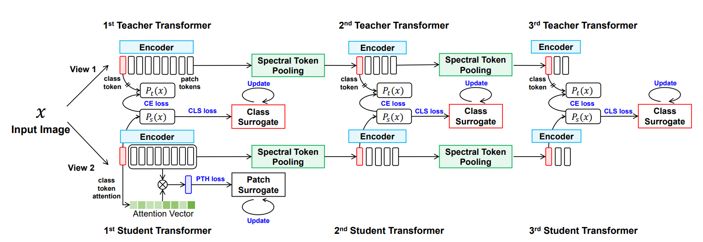

# HCTransformers

PyTorch implementation for **"Attribute Surrogates Learning and Spectral Tokens Pooling in Transformers for Few-shot Learning"**.  
[[`arxiv`](https://arxiv.org/abs/2203.09064v1)]

> Code will be continuously updated.

<div align="center">
  
</div>

## Prerequisites
This codebase has been developed with Python version 3.8, [PyTorch](https://pytorch.org/) version 1.9.0, CUDA 11.1 and torchvision 0.10.0. It has been tested on Ubuntu 20.04. 

## Training
We provide the training code for mini-ImageNet, tiered-ImageNet and CIFAR-FS, extending the **DINO** repo ([link](https://github.com/facebookresearch/dino)). Download links of datasets could be found in the **DeepEMD** repo ([link](https://github.com/icoz69/DeepEMD)).


### 1 Pre-train the First Transformer
To pre-train the first Transformer with attribute surrogates learning from scratch with multiple GPU, run:
```
python -m torch.distributed.launch --nproc_per_node=8 main_hct_first.py --arch vit_small --data_path /path/to/imagenet/train --output_dir /path/to/saving_dir
```

### 2 Train the Hierarchically Cascaded Transformers
To train the Hierarchically Cascaded Transformers with sprectral token pooling, run:
```
python -m torch.distributed.launch --nproc_per_node=8 main_hct_pooling.py --arch vit_small --data_path /path/to/imagenet/train --output_dir /path/to/saving_dir --pretrained_weights /path/to/pretrained_weights
```

## Evaluation
To evaluate the performance of the first Transformer on mini-ImageNet few-shot task, run:
```
python eval_hct_first.py --arch vit_small --data_path /path/to/imagenet/val
```

To evaluate the performance of the Hierarchically Cascaded Transformers on mini-ImageNet few-shot task, run:
```
python eval_hct_pooling.py --arch vit_small --data_path /path/to/imagenet/val
```

## License
This repository is released under the Apache 2.0 license as found in the [LICENSE](LICENSE) file.

## Citation
If you find our code or paper useful to your research work, please consider citing our work using the following bibtex:
```
@misc{he2022hct,
  author    = {He, Yangji and Liang, Weihan and Zhao, Dongyang and Zhou, Hong-Yu and Ge, Weifeng and Yu, Yizhou and Zhang, Wenqiang},
  title     = {Attribute Surrogates Learning and Spectral Tokens Pooling in Transformers for Few-shot Learning},
  publisher = {arXiv},
  year      = {2022},
  copyright = {arXiv.org perpetual, non-exclusive license}
}
```